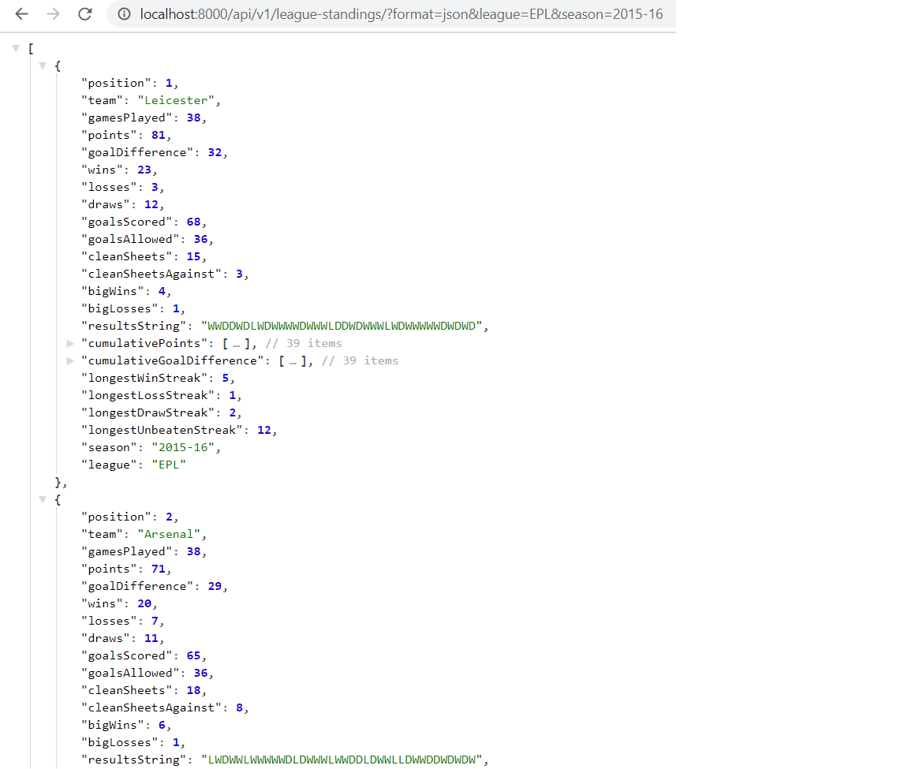

# futboller
Web-application that provides football data from the top 5 European leagues (API + frontend)

## About
- Open the `demo` folder in the root directory, and watch the demonstration via `demo.mp4`

## Installation
- Install the backend API dependencies with `pip install -r requirements.txt`
- Install ReactJS with `npm i react`
- Install React DOM with `npm i react-dom`
- Install React Router DOM with `npm i react-router-dom --save`
- Install React Table with `npm i react-table`
- Install React ChartJS 2 with `npm install --save react-chartjs-2`

## Usage
- From the `futbol` directory, run `python manage.py runserver` to run the local server.
- Visit the API documentation at `localhost:8000/api/v1/documentation/` to learn about the available endpoints.
- From the `futbol/frontend/futboller-frontend` directory, run `npm start` and open `localhost:3000` to interact with the frontend UI.

## Looping through offset barrier
- Use the following snippet to access all records of a resource by looping through the offset.
- Change the URL in the `get_api_data_via_offset_loop` function as needed.
```python
from typing import Dict, List, Union
import json
import requests


def get_api_data(url: str) -> Union[Dict, List]:
    """Gets data from API endpoint"""
    response = requests.get(url=url)
    if not response.ok:
        raise Exception(f"Error with response. Status code: {response.status_code}. URL: {url}")
    result = json.loads(response.text)
    return result


def get_api_data_via_offset_loop() -> List:
    """Gets data for all records of a resource by looping through the offset"""
    all_results = []
    offset = 1
    limit = 20
    while True:
        print(f"Offset: {offset}")
        url = f"http://localhost:8000/api/v1/cross-league-standings/?offset={offset}&limit={limit}"
        temp_result = get_api_data(url=url)
        all_results += temp_result
        offset += limit
        if len(temp_result) == 0:
            break
    return all_results


if __name__ == "__main__":
    results = get_api_data_via_offset_loop()
```

## Screenshots
#### API - League standings


#### UI - Scatter chart - CrossLeague - AvgPtsVsAvgGd (With team names)
.png)

#### UI - Scatter chart - CrossLeague - AvgPtsVsAvgGd (By league)
.png)

#### UI - Line chart - League - Title race
